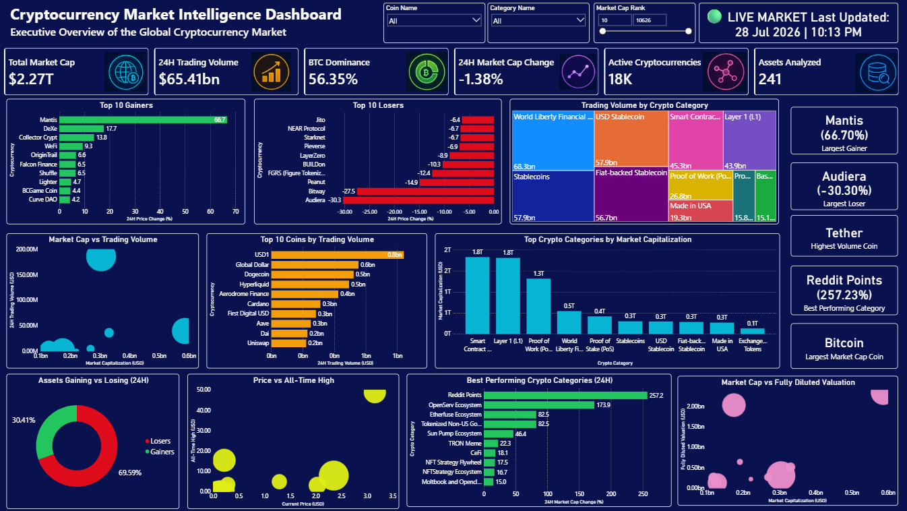
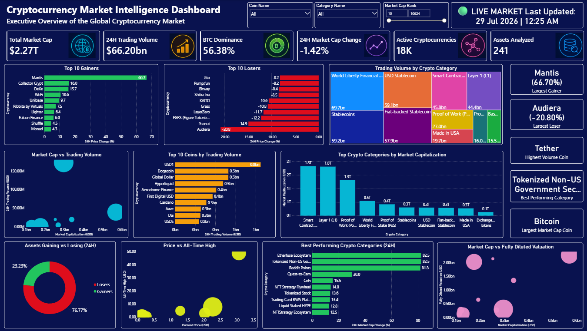
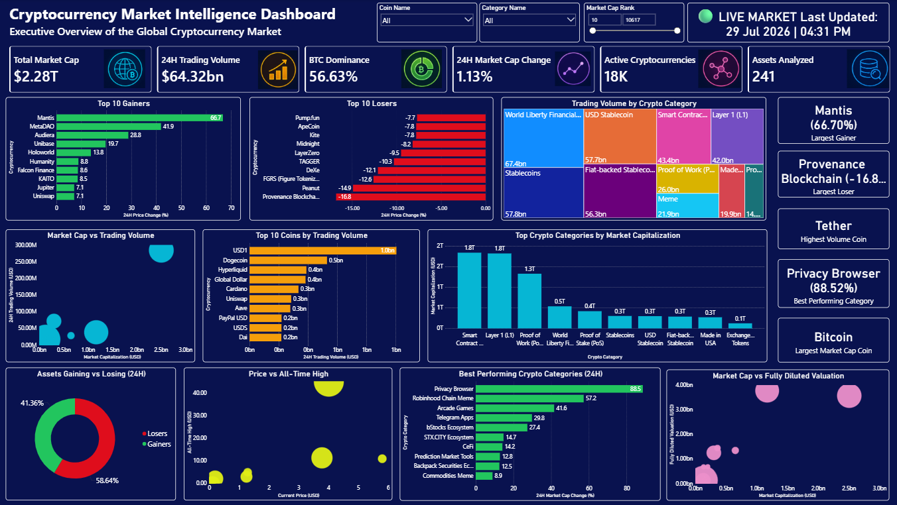
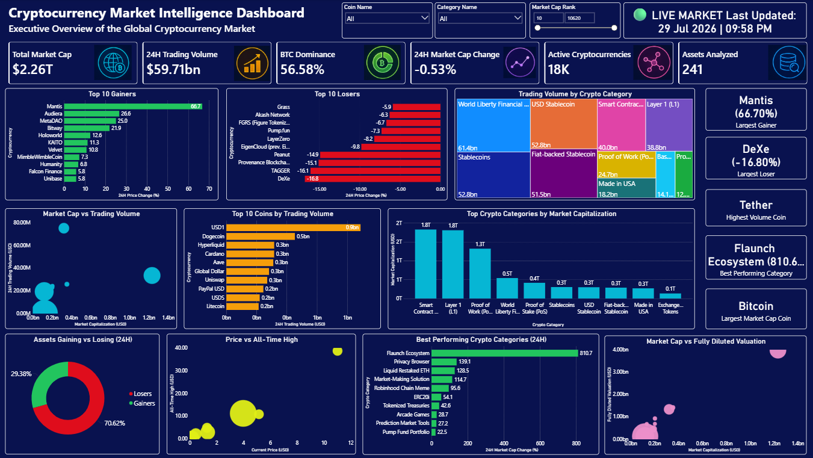

# Cryptocurrency Market Intelligence Dashboard

## Project Overview

The Cryptocurrency Market Intelligence Dashboard is an automated business intelligence solution that collects the latest cryptocurrency market data from the CoinGecko API, processes it using Python, and visualizes actionable insights through an interactive Power BI dashboard.

The project enables users to monitor overall market performance, identify top gainers and losers, analyze cryptocurrency categories, compare market capitalization with trading activity, and understand the overall market sentiment through an executive-level dashboard.

Unlike static dashboards, this project is designed to automatically fetch updated market data and maintain historical snapshots for future trend analysis.

---

## Problem Statement

The cryptocurrency market operates 24/7 and experiences rapid fluctuations in prices, trading volumes, market capitalization, and investor sentiment. Tracking hundreds of cryptocurrencies manually is inefficient and makes it difficult to identify meaningful market trends.

This project addresses these challenges by building an automated analytics solution that:

- Collects the latest cryptocurrency market data from a live API
- Processes and cleans the data automatically
- Stores historical market snapshots
- Presents interactive visualizations for quick decision-making
- Helps users monitor market movements and performance from a single dashboard

---

## Dashboard Features

### Executive KPIs

- Total Market Capitalization
- 24-Hour Trading Volume
- Bitcoin Dominance
- 24-Hour Market Cap Change
- Active Cryptocurrencies
- Assets Analyzed
- Last Data Refresh Timestamp

### Market Performance

- Top 10 Gainers
- Top 10 Losers
- Largest Gainer
- Largest Loser
- Assets Gaining vs Losing (Market Sentiment)

### Category Analysis

- Trading Volume by Cryptocurrency Category
- Top Categories by Market Capitalization
- Best Performing Categories (24 Hours)

### Market Analysis

- Market Capitalization vs Trading Volume
- Market Capitalization vs Fully Diluted Valuation
- Price vs All-Time High
- Top Coins by Trading Volume

### Interactive Features

- Coin Name Filter
- Category Filter
- Market Cap Rank Filter
- Dynamic KPIs
- Cross-filtering across visuals

---

## Dashboard Preview

---

## Technologies Used

- Python
- Pandas
- NumPy
- CoinGecko API
- SQL
- Power BI
- DAX
- Power Query
- GitHub

---

## Dataset Information

Source:
- CoinGecko API

The dataset contains information such as:

- Cryptocurrency Name
- Symbol
- Current Price
- Market Capitalization
- Market Cap Rank
- Trading Volume
- Circulating Supply
- Total Supply
- Maximum Supply
- Fully Diluted Valuation
- All-Time High
- All-Time Low
- Price Change (24 Hours)
- Market Cap Change (24 Hours)
- Cryptocurrency Categories

---

## Key Business Insights

The dashboard helps answer questions such as:

- Which cryptocurrencies gained the most in the last 24 hours?
- Which cryptocurrencies experienced the largest losses?
- What is the current global cryptocurrency market capitalization?
- Which cryptocurrency has the highest trading volume?
- Which cryptocurrency category is performing the best?
- What percentage of tracked assets are gaining versus losing?
- Which sectors dominate the cryptocurrency market?
- How does trading volume compare with market capitalization?

---

## Skills Demonstrated

- API Integration
- ETL Pipeline Development
- Data Cleaning
- Data Transformation
- Data Modeling
- SQL
- Power Query
- DAX
- Dashboard Design
- Business Intelligence
- Data Visualization
- KPI Development
- Data Storytelling

---

## Future Enhancements

- Automated scheduled refresh
- Historical trend analysis dashboard

---

## Project Highlights

- Automated cryptocurrency data collection
- Live market data from CoinGecko API
- Historical data storage for trend analysis
- Interactive Power BI dashboard
- Executive KPI reporting
- Dynamic filtering and cross-highlighting
- Professional dark-themed dashboard
- End-to-end data analytics pipeline

---

## Author

**Pranjali Sus**

Aspiring Data Analyst | Business Intelligence | Power BI | Tableau | SQL | Python

---

## ⭐ If you found this project useful, consider giving this repository a star!
